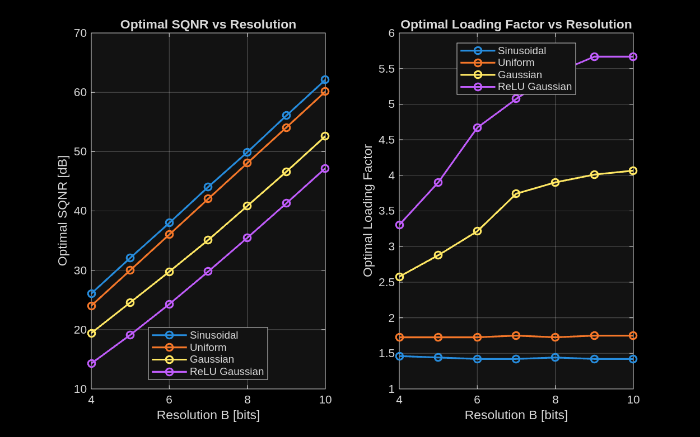
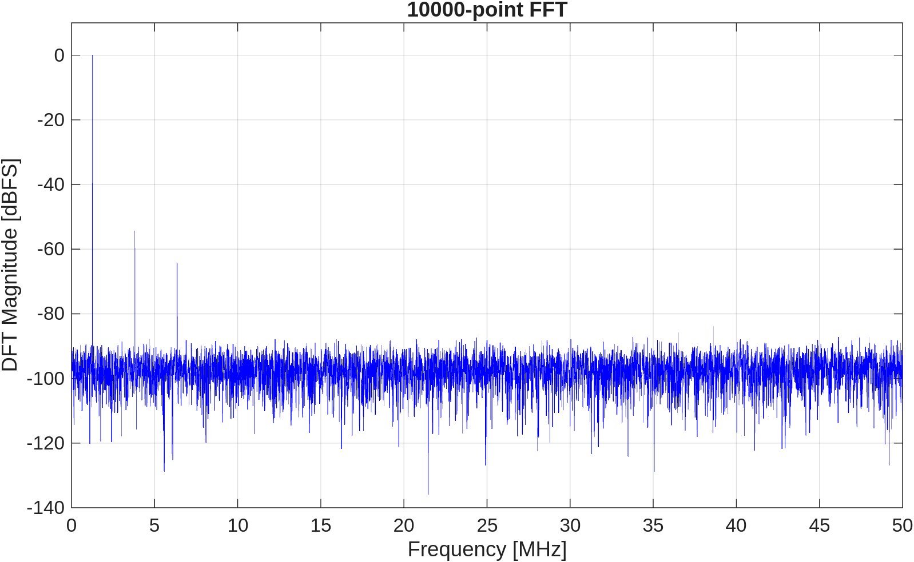

# ET4369 Nyquist-Rate Data Converters

Homework series for ET4369 at TU Delft: quantization theory, DAC design trade-offs, and ADC spectral characterization, all worked out in MATLAB with the derivations written up in LaTeX. Each homework folder contains the assignment, the submitted report, the scripts, and the generated figures.

## HW1: Quantization and SQNR

Built a bipolar mid-rise quantizer model (`quantize_bipolar_midrise.m`), demonstrated ideal and broken transfer characteristics, and swept the loading factor to find the SQNR optimum for four input statistics: sinusoidal, uniform, Gaussian, and ReLU Gaussian.

The left panel confirms the familiar 6 dB per bit slope with an offset set by the input distribution; the right panel shows that the optimal loading factor is flat for bounded inputs but grows with resolution for Gaussian-tailed inputs, where clipping must become rarer as quantization noise drops.

## HW2: Current-steering DAC design

Based on the Lin and Bult 10 b 500 MS/s CMOS DAC paper (included in `hw2/`):

- Zero-order-hold reconstruction: amplitude envelopes and output tones for different hold pulse widths at f_s = 125 MHz.
- Re-optimized the segmented DAC for a 12 bit converter in 65 nm: swept the thermometer/binary split B_t against total area (unit elements plus decoder) under INL, DNL < 0.5 LSB at 95% yield.
- Monte Carlo DNL/INL envelopes and rms profiles versus code for several unit-element areas, showing how matching area buys linearity.

Per-problem write-ups are in `hw2/part1.md` through `hw2/part4.md`.

## HW3: ADC spectral metrics and pipeline ADCs

Computed spectral performance metrics from a captured ADC output record (`hw3_adc_out.mat`, 10000-point FFT): SNR 58.9 dB, SNDR 52.9 dB, ENOB 8.5 bits, THD −54.2 dB, SFDR 54.6 dB at f_in = 1.27 MHz.

Later problems analyze pipeline ADC architectures with reference to the included papers (10 bit 205 MS/s pipeline ADC in 90 nm; HermesE 96-channel neural interface). Worked answers are in `hw3/solutions.md`.

## Repository layout

| Path | Contents |
| --- | --- |
| `hw1/` | Quantizer model, SQNR sweeps, report (`HW1_ET4369_5714699.pdf`) |
| `hw2/` | ZOH reconstruction, DAC segmentation and matching analysis, report |
| `hw3/` | Spectral metrics, pipeline ADC analysis, report |

All scripts run in plain MATLAB without extra toolboxes.
