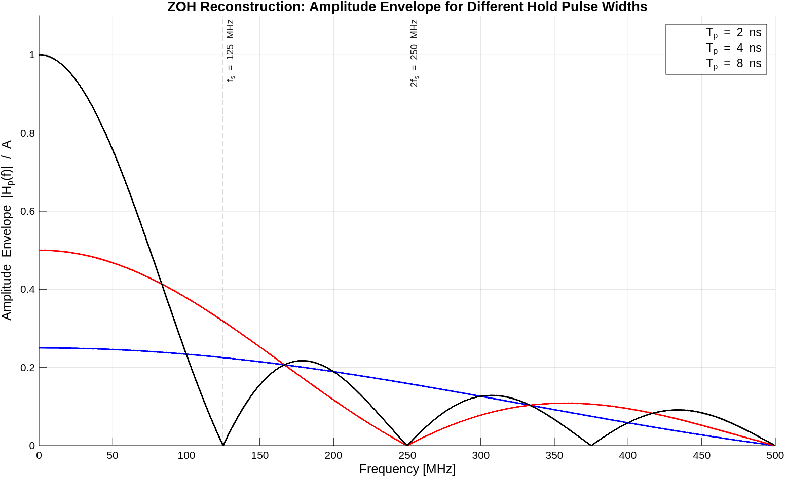
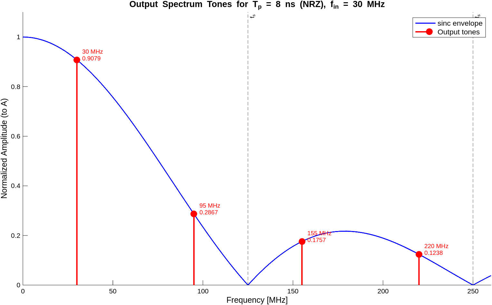

# Problem 1: Reconstruction

**Given:** Discrete-time signal $x(n)$ with $f_s = 125$ MHz, converted to continuous time using zero-order-hold (ZOH) pulses.

## Part (a): Amplitude Envelopes

For a rectangular hold pulse of width $T_p$, the ZOH output spectrum is the sampled spectrum multiplied by the amplitude envelope:

$$|H_p(f)| = \frac{T_p}{T_s} \cdot |\text{sinc}(f \cdot T_p)| = \frac{T_p}{T_s} \cdot \left|\frac{\sin(\pi f T_p)}{\pi f T_p}\right|$$

where $T_s = 1/f_s = 8$ ns.

The three hold pulse widths and their DC gains ($T_p/T_s$):

| $T_p$ | $T_p/T_s$ | Description                    |
|--------|------------|--------------------------------|
| 2 ns   | 0.25       | Short RZ pulse (¼ of period)   |
| 4 ns   | 0.50       | Half-period RZ pulse           |
| 8 ns   | 1.00       | Full-period NRZ ($T_p = T_s$)  |

**Observations:**
- The **8 ns (NRZ)** case has the highest DC gain (1.0) but the steepest sinc roll-off, with a null at $f_s = 125$ MHz. This provides the strongest suppression of spectral images near $f_s$, but also the most in-band signal droop.
- The **2 ns** case has the flattest response across frequency (first null at $1/T_p = 500$ MHz), but only 0.25 DC gain. Images are poorly suppressed.
- The **4 ns** case is intermediate: first null at 250 MHz, DC gain of 0.5.

## Part (b): Output Tones for 8 ns Hold, 30 MHz Sine Input

With $T_p = 8$ ns (NRZ, $T_p = T_s$), $f_{in} = 30$ MHz, and $f_s = 125$ MHz.

The sampled signal contains spectral images at frequencies $f = f_{in} + k \cdot f_s$ for all integers $k$. Folding to positive frequencies, the tones up to 250 MHz are:

| Tone | Frequency | Origin           | $f \cdot T_p$ | $\text{sinc}(f \cdot T_p)$ | Amplitude / $A$ |
|------|-----------|------------------|----------------|-----------------------------|------------------|
| 1    | 30 MHz    | $f_{in}$         | 0.24           | 0.9079                      | **0.9079**       |
| 2    | 95 MHz    | $f_s - f_{in}$   | 0.76           | 0.2867                      | **0.2867**       |
| 3    | 155 MHz   | $f_s + f_{in}$   | 1.24           | 0.1757                      | **0.1757**       |
| 4    | 220 MHz   | $2f_s - f_{in}$  | 1.76           | 0.1238                      | **0.1238**       |

Each tone's amplitude (normalized to $A$) equals the sinc envelope evaluated at that frequency:

$$\text{Amplitude}(f) = |\text{sinc}(f \cdot T_p)| = \frac{|\sin(\pi f T_p)|}{\pi f T_p}$$

since $T_p / T_s = 1$ for the NRZ case.

**Observations:**
- The fundamental at 30 MHz suffers about **9.2% attenuation** (sinc droop) — from $A$ to $0.908A$.
- The first image at 95 MHz ($= f_s - f_{in}$) is the strongest unwanted tone, at $0.287A$ ($-10.0$ dB relative to the fundamental).
- Images at 155 MHz and 220 MHz are further suppressed by the sinc envelope to $0.176A$ and $0.124A$ respectively.
- A reconstruction filter is needed to suppress these image tones and optionally compensate the sinc droop on the fundamental.
