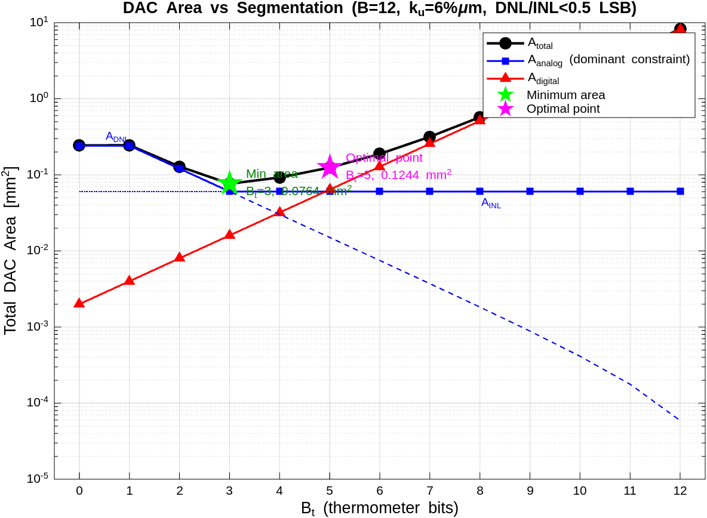

# Problem 3: DAC Area Optimization

**Task:** Re-optimize the 8/2 segmented DAC from the Lin & Bult paper for a 65-nm technology with different process parameters, finding optimal $B_t$ (thermometer bits) and $A_{unit}$ (unit element area).

## Given Parameters

| Parameter       | Value                          |
|-----------------|--------------------------------|
| $B$             | 12 bits                        |
| $\text{INL}_{\text{spec}}$ | < 0.5 LSB          |
| $\text{DNL}_{\text{spec}}$ | < 0.5 LSB          |
| $Y$             | 95%                            |
| $A_{\text{decode}}$ | $2^{B_t} \cdot 2000\;\mu\text{m}^2$ |
| $A_{\text{total}}$  | $2^B \cdot A_{\text{unit}} + A_{\text{decode}}$ |
| $k_u$           | 6%$\mu$m                       |
| $\sigma_u$      | $k_u / \sqrt{A_{\text{unit}}}$ |

## Hand Calculations

### Key Formulas

Following the procedure from the Lin & Bult paper (Section IV–V, Table I, Fig. 9):

**Unit element mismatch:**

$$\sigma_u = \frac{k_u}{\sqrt{A_{\text{unit}}}} = \frac{0.06}{\sqrt{A_{\text{unit}}}}$$

**Worst-case DNL** (at the major carry transition, where one thermometer element of $2^{B_b}$ unit elements switches ON and the binary section at full scale of $2^{B_b}-1$ elements switches OFF):

$$\sigma_{\text{DNL,max}} = \sqrt{2^{B_b+1} - 1} \cdot \sigma_u \quad \text{for } B_t \geq 1$$

**Worst-case INL** (at midcode, independent of segmentation — see Fig. 8 of the paper):

$$\sigma_{\text{INL,max}} = 0.5 \cdot \sqrt{2^B} \cdot \sigma_u = 32\,\sigma_u$$

**Area relationship** (equation 2 from paper): $\text{Area} \propto 1/\sigma^2$

### Deriving Constraints

Following the paper's procedure, we set $\sigma = \text{spec}$ (1$\sigma$ confidence level):

**DNL constraint:**

$$\sqrt{2^{B_b+1}-1} \cdot \sigma_u \leq 0.5 \quad\Rightarrow\quad \sigma_u \leq \frac{0.5}{\sqrt{2^{B_b+1}-1}}$$

$$A_{\text{unit,DNL}} = \left(\frac{k_u}{\sigma_{u,\text{max}}}\right)^2 = \frac{k_u^2 \cdot (2^{B_b+1}-1)}{0.25}$$

**INL constraint:**

$$32\,\sigma_u \leq 0.5 \quad\Rightarrow\quad \sigma_u \leq \frac{1}{64} = 0.015625$$

$$A_{\text{unit,INL}} = \left(\frac{0.06}{0.015625}\right)^2 = 3.84^2 = 14.75\;\mu\text{m}^2$$

The INL constraint is **independent of $B_t$** — it always requires $A_{\text{unit}} \geq 14.75\;\mu\text{m}^2$.

### Sweep Results

| $B_t$ | $B_b$ | $A_{\text{unit,DNL}}$ ($\mu$m²) | $A_{\text{unit}}$ ($\mu$m²) | $A_{\text{analog}}$ ($\mu$m²) | $A_{\text{digital}}$ ($\mu$m²) | $A_{\text{total}}$ ($\mu$m²) | Constraint |
|-------|-------|-----|------|---------|---------|---------|------|
| 0 | 12 | 59.0 | 59.0 | 241,533 | 2,000 | 243,533 | DNL |
| 1 | 11 | 59.0 | 59.0 | 241,533 | 4,000 | 245,533 | DNL |
| 2 | 10 | 29.5 | 29.5 | 120,737 | 8,000 | 128,737 | DNL |
| **3** | **9** | **14.7** | **14.75** | **60,398** | **16,000** | **76,398** | **INL** |
| 4 | 8 | 7.4 | 14.75 | 60,398 | 32,000 | 92,398 | INL |
| **5** | **7** | **3.7** | **14.75** | **60,398** | **64,000** | **124,398** | **INL** |
| 6 | 6 | 1.8 | 14.75 | 60,398 | 128,000 | 188,398 | INL |
| 7 | 5 | 0.9 | 14.75 | 60,398 | 256,000 | 316,398 | INL |

(Higher $B_t$ values continue with fixed $A_{\text{analog}}$ and exponentially growing $A_{\text{digital}}$.)

## Part (a)(i): Minimum Total Area

The minimum total area occurs at **$B_t = 3$, $B_b = 9$**:

- $A_{\text{unit}} = 14.75\;\mu\text{m}^2$ (set by the INL constraint; DNL constraint nearly equal at 14.73 $\mu$m²)
- $A_{\text{analog}} = 2^{12} \times 14.75 = 60{,}398\;\mu\text{m}^2$
- $A_{\text{digital}} = 2^3 \times 2000 = 16{,}000\;\mu\text{m}^2$
- **$A_{\text{total}} = 76{,}398\;\mu\text{m}^2 \approx 0.076\;\text{mm}^2$**

At this point, $B_t = 3$ is the crossover where the DNL and INL constraints meet — the DNL constraint relaxes enough (as $B_b$ decreases) that the INL constraint takes over. For $B_t < 3$, DNL dominates and requires a much larger $A_{\text{unit}}$; for $B_t > 3$, the analog area stays fixed but digital area grows exponentially.

## Part (a)(ii): Optimal Point (Analog = Digital Area)

The "optimal point" from the paper is where **$A_{\text{analog}} = A_{\text{digital}}$**. At this point, the analog area equals the digital area, and THD performance is minimized under the minimum-area constraint (see Fig. 10 of the paper).

Solving for exact $B_t$:

$$2^{B_t} \cdot 2000 = 60{,}398 \quad\Rightarrow\quad 2^{B_t} = 30.2 \quad\Rightarrow\quad B_t = 4.92$$

The nearest integer is **$B_t = 5$** ($B_b = 7$):

- $A_{\text{unit}} = 14.75\;\mu\text{m}^2$
- $A_{\text{analog}} = 60{,}398\;\mu\text{m}^2$
- $A_{\text{digital}} = 64{,}000\;\mu\text{m}^2$ (ratio analog/digital = 0.94, close to 1)
- **$A_{\text{total}} = 124{,}398\;\mu\text{m}^2 \approx 0.124\;\text{mm}^2$**

This is about 1.6× larger than the minimum area design, but provides better frequency-domain performance (lower THD) due to more thermometer coding in the MSB section.

## Part (b): Area vs Segmentation Plot

The plot shows the characteristic shape from the paper's Fig. 9:
- **$A_{\text{analog}}$ (blue):** For small $B_t$, the DNL constraint dominates and the analog area decreases sharply as $B_t$ increases. For $B_t \geq 3$, the INL constraint takes over and the analog area flattens.
- **$A_{\text{digital}}$ (red):** The decoder area grows exponentially as $2^{B_t} \cdot 2000$.
- **$A_{\text{total}}$ (black):** The sum has a clear minimum at $B_t = 3$ (green star). The optimal point at $B_t = 5$ (magenta star) is where analog and digital areas are approximately equal.
