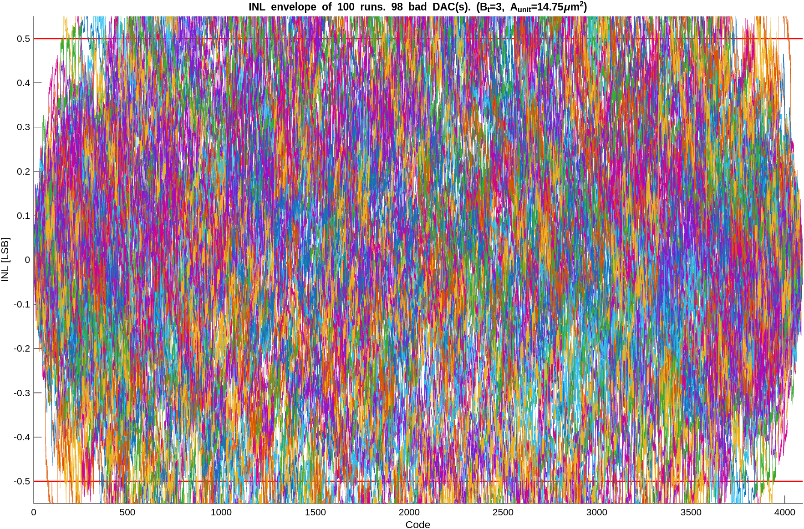
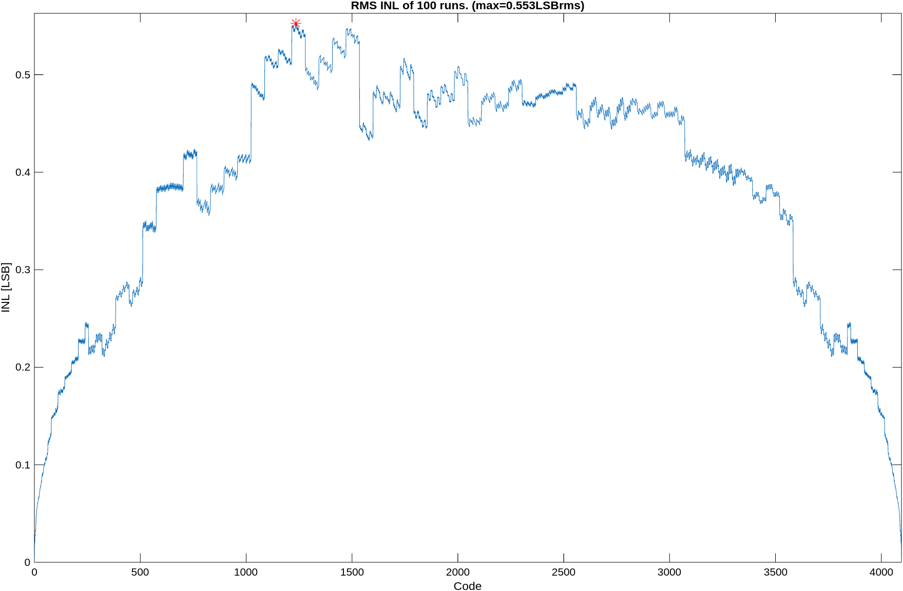
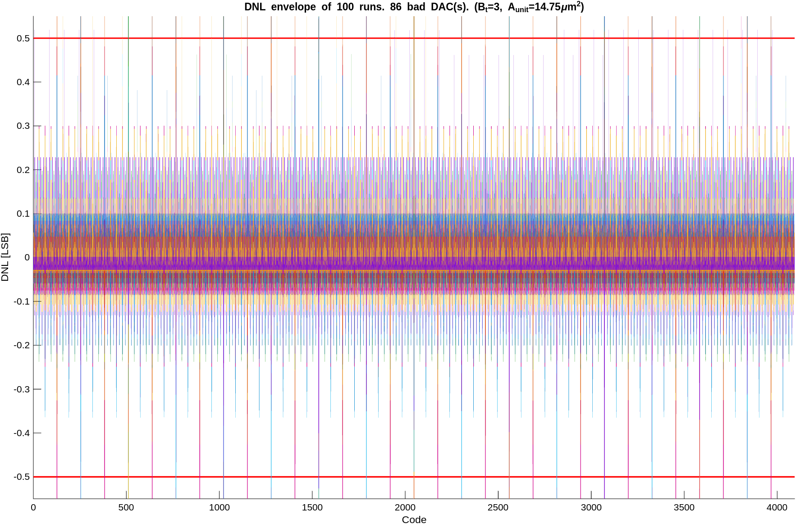
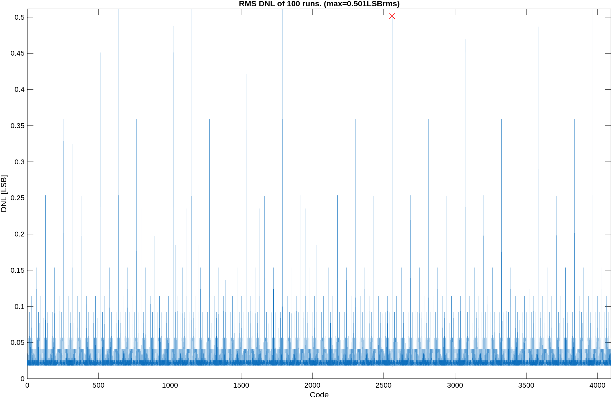
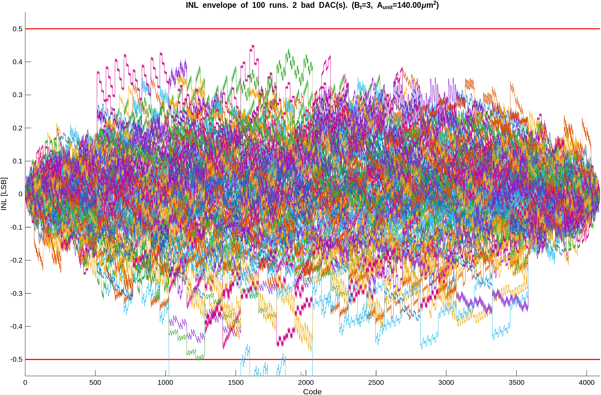
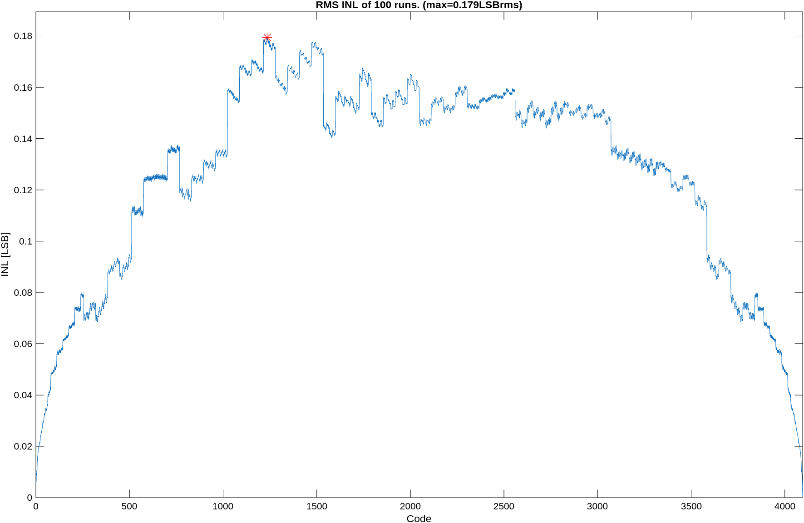
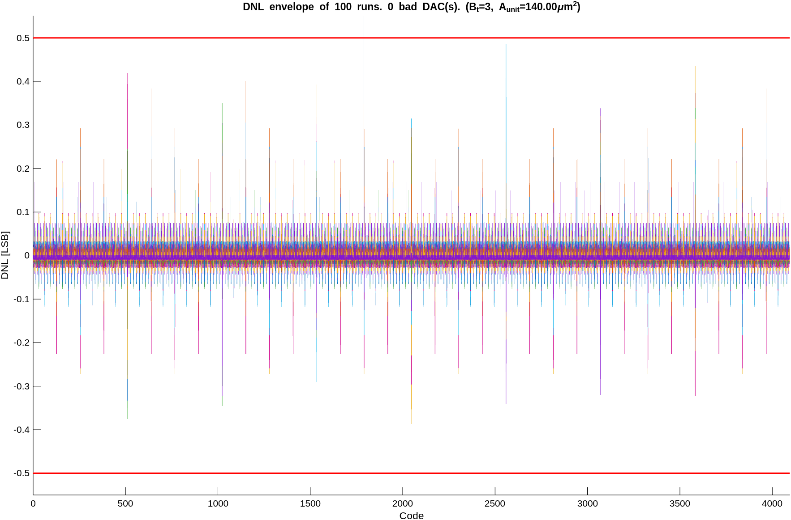
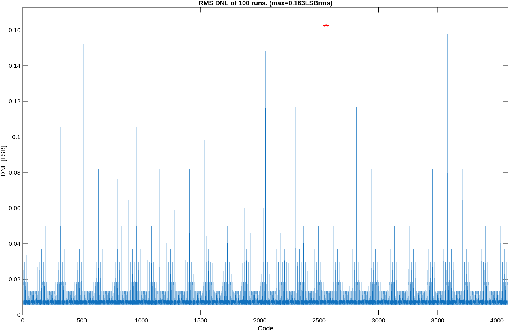

# Problem 4: Monte Carlo Simulation

**Task:** Simulate the minimum-area DAC design from Problem 3(a)(i) using Monte Carlo, add DNL analysis code, and iterate $A_{\text{unit}}$ to achieve 95% yield.

## Part (a): Added DNL Code

DNL calculation and plotting code was added to `hw2_dac.m` below the `"Your code goes here"` marker. See the file for the added code.

## Part (b): INL and DNL Plots with Initial Design ($B_t = 3$, $A_{\text{unit}} = 14.75\;\mu\text{m}^2$)

Using the minimum-area design from Problem 3(a)(i): $B_t = 3$, $A_{\text{unit}} = 14.75\;\mu\text{m}^2$, $\sigma_u = 0.01562$.

### INL Envelope and RMS

### DNL Envelope and RMS

**Results:** 98/100 bad INL, 86/100 bad DNL — yield is only **1%**.

## Part (c): Does the Initial Design Meet the Yield Spec?

**No**, the initial design completely fails the 95% yield target. Only 1 out of 100 DACs meets both DNL < 0.5 LSB and INL < 0.5 LSB simultaneously.

**Why it fails:** The hand calculation in Problem 3 followed the paper's procedure of setting the spec equal to **1$\sigma$** of the worst-case nonlinearity:

$$\sigma_{\text{INL,max}} = 32\,\sigma_u = 0.5 \;\text{LSB} \quad(\text{1}\sigma)$$

This means the worst-case INL exceeds 0.5 LSB about **32%** of the time at the most critical code (midscale). With 4096 codes and many contributing to the peak INL, virtually every DAC has at least one code violating the spec.

To achieve 95% yield across all codes simultaneously, we need $\sim$3$\sigma$ margin, i.e., the spec should equal approximately $3\sigma$ rather than $1\sigma$. This requires $\sigma_u$ to be $\sim$3× smaller, meaning $A_{\text{unit}}$ must be $\sim$9× larger (since $A \propto 1/\sigma^2$).

## Part (d): Adjusted Design for 95% Yield

Sweeping $A_{\text{unit}}$ from 110 to 180 $\mu$m² (with $B_t = 3$ fixed), averaging over 10 random seeds:

| $A_{\text{unit}}$ ($\mu$m²) | $\sigma_u$ | Average Yield |
|---|---|---|
| 110 | 0.00572 | 89.7% |
| 120 | 0.00548 | 91.8% |
| 130 | 0.00526 | 93.7% |
| **140** | **0.00507** | **95.5%** |
| 150 | 0.00490 | 96.1% |
| 160 | 0.00474 | 97.2% |

**$A_{\text{unit}} = 140\;\mu\text{m}^2$** achieves an average yield of **95.5%** ($\leq$ 5 bad DACs on average out of 100), meeting the spec.

### Final Design

| Parameter | Value |
|-----------|-------|
| $B_t$ | 3 |
| $B_b$ | 9 |
| $A_{\text{unit}}$ | $140\;\mu\text{m}^2$ |
| $\sigma_u$ | 0.00507 |
| $A_{\text{analog}}$ | $4096 \times 140 = 573{,}440\;\mu\text{m}^2$ |
| $A_{\text{digital}}$ | $8 \times 2000 = 16{,}000\;\mu\text{m}^2$ |
| **$A_{\text{total}}$** | **$589{,}440\;\mu\text{m}^2 = 0.589\;\text{mm}^2$** |

The final area is about **7.7× larger** than the 1$\sigma$ minimum-area design (0.076 mm²). This increase factor of $\sim$(140/14.75) $\approx$ 9.5 in unit element area corresponds to a $\sqrt{9.5} \approx 3.1\times$ reduction in $\sigma_u$, confirming that $\sim$3$\sigma$ margin is needed for 95% yield with a 12-bit DAC.

### Final Plots ($B_t = 3$, $A_{\text{unit}} = 140\;\mu\text{m}^2$)

**Results with $A_{\text{unit}} = 140\;\mu\text{m}^2$:**
- Bad INL: 2/100, Bad DNL: 0/100, Overall yield: **98%** ✓
- RMS INL peak: 0.179 LSBrms (at midcode), matching the expected dome shape
- RMS DNL peak: 0.163 LSBrms (at major carry transitions every $2^{B_b} = 512$ codes)
